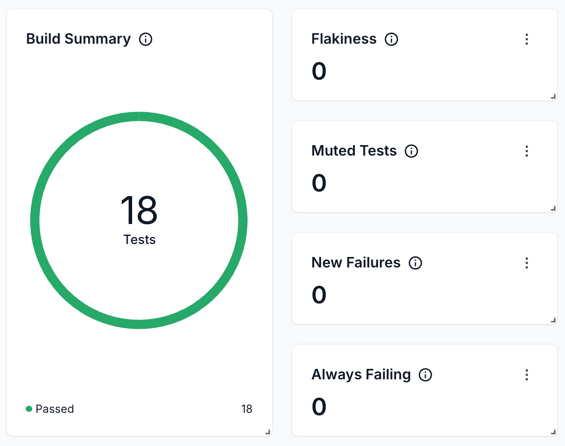
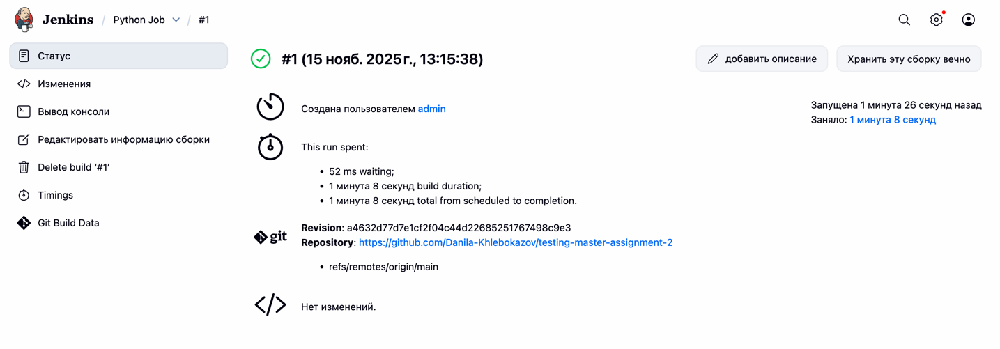
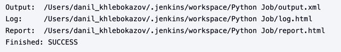
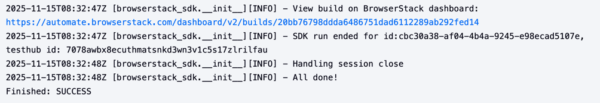

## Robot Test Cases for Demoblaze Website

### Test Cases
TS 1: Sign Up
   - Open browser and go to https://www.demoblaze.com/
   - Click "Sign up"
   - Enter username and password
   - Click "Sign up" button
   - Verify alert message “Sign up successful.”

TS 2: Log In
   - Open browser and go to https://www.demoblaze.com/
   - Click "Log in"
   - Enter valid username/password
   - Click "Log in"
   - Verify user name is displayed in the navbar

TS 3: Log Out
   - Log in first
   - Click "Log out"
   - Verify “Log in” button reappears

TS 4: Buy Product
   - Log in
   - Select any product from the list
   - Click “Add to cart”
   - Go to “Cart”
   - Click “Place Order”
   - Fill form and confirm purchase
   - Verify “Thank you for your purchase!”

TS 5: Contact Button
    - Click "Contact" button
    - Fill in contact form (email, name, message)
    - Click "Send message"
    - Verify alert message “Thanks for the message!!”

TS 6: Category Filter
   - Select any category (e.g., Laptops)
   - Verify only products from that category are displayed

### BrowserStack

There is also a report included with the test cases. [report_browserstack.html](report_browserstack.html)

### Jenkins

